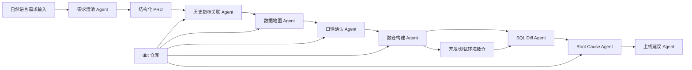

# Data Dev Copilot-端到端数据开发提效 Agent-MVP-v0.1 PRD

## 0. 文档元信息

| 字段 | 内容 |
|---|---|
| 文档标题 | Data Dev Copilot-端到端数据开发提效 Agent-MVP-v0.1 |
| 文档状态 | 草稿 |
| 优先级 | P0 |
| 版本 | v0.1 |
| 日期 | 2026-05-29 |
| 作者 | 待确认 |
| 产品负责人 | 待确认 |
| 算法负责人 | 待确认 |
| 后端负责人 | 待确认 |
| 前端负责人 | 待确认 |
| 测试负责人 | 待确认 |
| 设计负责人 | 待确认 |
| 关联链接 | 交互稿：待确认；视觉稿：待确认；接口文档：待确认；埋点文档：待确认；测试用例：待确认 |

### 版本历史

| 版本 | 日期 | 作者 | 变更内容 |
|---|---|---|---|
| v0.1 | 2026-05-29 | 待确认 | 基于最终 SPEC 梳理 MVP PRD 初稿 |

## 1. 需求背景与目标

### 1.1 现状痛点

数据分析师在常见数据开发需求中，需要反复完成需求澄清、历史指标查找、口径确认、数据源识别、数仓开发沟通、验数 SQL 编写和上线判断。

当前流程主要依赖人工经验，存在以下问题：

1. 需求描述不结构化，业务规则、指标口径、粒度、过滤条件、验收标准经常遗漏。
2. 历史 dbt model、metrics、exposures、schema 文档中的可复用口径难以及时发现。
3. 指标冲突、粒度冲突、时间窗口冲突、过滤条件冲突经常到开发或验数阶段才暴露。
4. 数据开发工程师需要花大量时间理解需求、选择数据源、判断 join key、编写 dbt model 和基础 tests。
5. 验数 SQL、Diff 逻辑、上线建议依赖人工编写和经验判断，返工成本高。

合规政策要求：待确认。MVP 默认要求对发送给外部大模型 API 的敏感字段名和值进行脱敏，不发送数据库账号、host、token、密钥和真实数据明细。

### 1.2 核心目标

业务目标：

1. 需求澄清时间降低约 50%。
2. 常见分析型数据开发需求的开发时间降低约 30%。
3. 因口径不清导致的返工率明显下降。
4. 提升历史 dbt 资产复用率。
5. 提升基础 schema tests 和验数 SQL 覆盖率。

体验目标：

1. 分析师可以从自然语言开始，不需要一开始就写完整技术需求。
2. AI 最多追问 3 轮，控制交互成本。
3. 每一步都展示当前状态、已完成事项、待确认事项和下一步动作。
4. 冲突、风险、待人工确认项必须清晰呈现，不由 AI 自动裁决。
5. 数开可以在本地分支查看 AI 生成的 dbt 变更，并决定是否进入后续 PR 流程。

### 1.3 关键验收指标

| 指标类型 | 验收指标 |
|---|---|
| AI 准确率要求 | 常见需求下，AI 能生成可审查的 PRD、dbt model、基础 schema tests 和验数 SQL |
| 历史资产推荐 | AI 推荐的历史 model / metric 对分析师有实际参考价值 |
| 冲突检测 | AI 能识别主要指标冲突，并提供可追溯证据 |
| 代码生成 | AI 生成的 dbt 代码符合项目目录、命名、分层和 materialization 规范 |
| Join Key 推荐 | 推荐结果必须包含依据和置信度 |
| 验证结果 | dbt build/test 和 SQL Diff 结果可支持人工 Review |
| 上线建议 | 稳定输出：建议上线 / 不建议上线 / 需人工确认 |
| 性能耗时要求 | 待确认 |
| 服务可用性要求 | 待确认 |

## 2. 用户与场景定义

### 2.1 用户角色与权限

| 用户角色 | 角色说明 | 核心权限 |
|---|---|---|
| 数据分析师 | 主用户，负责提出业务需求、确认口径、查看 AI 产物 | 输入需求、回答追问、编辑 PRD、查看历史资产推荐、确认冲突、查看验数 SQL 和上线建议 |
| 数据开发工程师 | 次用户，负责 Review AI 生成的 dbt 变更 | 查看 dbt model、schema.yml、tests、Join Key 依据、运行结果，决定是否提交 PR |
| 管理员 / 平台配置人员 | 待确认 | 配置 dbt 仓库、开发/测试环境数仓连接、脱敏规则、模型参数、权限策略 |

权限限制：

1. MVP 不区分免费用户、付费用户等商业化角色。
2. MVP 默认面向企业内部数据团队使用。
3. 对话次数、上下文长度、并发限制：待确认。
4. AI 可写入本地 Git 分支，但不自动创建 PR、不自动 merge、不自动上线生产。

### 2.2 典型场景描述

#### 场景一：新增常见分析指标

分析师输入：

> 我想新增一个用户 7 日留存指标，用于增长日报，希望按渠道、版本、注册日期分析，排除测试账号和内部员工。

系统流程：

1. AI 识别需求不完整。
2. AI 追问留存行为、时间窗口、渠道口径、过滤逻辑等问题。
3. AI 生成结构化 PRD。
4. AI 搜索 dbt 仓库中的历史留存 model / metric。
5. AI 输出复用建议、差异对比和风险提示。
6. AI 生成 dbt model、schema.yml、基础 tests 和验数 SQL。
7. AI 在开发/测试环境运行 dbt build/test 和 SQL Diff。
8. AI 输出上线建议。

#### 场景二：已有口径相似的新指标需求

分析师提出一个新指标，但 dbt 仓库中存在相似 model / metric。

系统流程：

1. AI 推荐最相关的历史 model / metric。
2. AI 展示字段、粒度、过滤条件、时间窗口差异。
3. AI 检测是否存在同名不同口径、同口径不同命名等冲突。
4. 冲突由分析师或数开人工确认，AI 不自动裁决。

#### 产品架构图

## 3. 功能范围与边界

### 3.1 本期范围

MVP 必须交付以下能力：

1. 自然语言需求输入。
2. 需求澄清 Agent：
   - 基于固定字段、风险判断和最多 3 轮追问机制补齐需求。
   - 生成结构化分析师 PRD。
3. dbt 仓库检索：
   - `manifest.json`
   - `catalog.json`
   - model SQL
   - `schema.yml`
   - tests
   - docs
   - exposures
   - metrics
4. 历史指标关联：
   - 推荐相似 model / metric / exposure。
   - 展示推荐理由、差异对比和风险提示。
5. 数据地图 Agent：
   - 基于 dbt DAG 生成完整上下游血缘。
   - 覆盖 source、staging、intermediate、marts、metrics、exposures。
6. 自动识别数据源：
   - 优先基于相似历史 model / metric / exposure 反推 source / staging model。
7. 口径确认 Agent：
   - 检测同名不同口径、同口径不同命名、粒度冲突、时间窗口冲突、过滤条件冲突、维度定义冲突。
   - 只报告冲突和证据，不自动给结论。
8. 数仓构建 Agent：
   - 按现有 dbt 项目模板生成 model SQL、schema.yml 和基础 schema tests。
   - 遵循目录结构、命名、materialization、分层规范。
9. Join Key 推荐：
   - 综合 dbt tests、catalog 统计、历史 join 模式、命名语义打分。
   - 输出置信度和依据。
10. SQL 优化：
   - 做 dbt 最佳实践优化，包括 ref/source 使用、增量模型、分区过滤、避免硬编码。
11. 自动生成基础 schema tests：
   - `not_null`
   - `unique`
   - `accepted_values`
   - `relationships`
12. 验数 SQL Diff Agent：
   - 以历史相似 model / metric 作为对照基准。
   - 自动生成验数 SQL。
13. 开发/测试环境验证：
   - 运行 dbt build/test。
   - 运行验数 SQL。
14. Root Cause Agent：
   - 基于 dbt manifest/catalog 分析异常原因。
15. 上线建议：
   - 输出建议上线 / 不建议上线 / 需人工确认。
16. 最终产物记录：
   - PRD
   - dbt 代码
   - tests
   - 验数 SQL
   - 上线建议

### 3.2 明确不做

MVP 明确不做：

1. 不自动上线生产。
2. 不自动 merge 代码。
3. 不自动创建 PR。
4. 不接 BI / FineReport。
5. 不分析看板影响。
6. 不接 OpenMetadata / DQC API。
7. 不自动创建 DQC。
8. 不接埋点平台。
9. Root Cause 不分析埋点变化。
10. 不做低风险需求的自动发布。
11. 不替代数据分析师或数据开发工程师的最终判断。
12. 指标冲突不由 AI 自动裁决，只报告证据和冲突点。
13. 不保证一次性生成生产可直接上线代码，必须经过人工 Review。

### 3.3 跨端影响范围

MVP 主要交付形态：

1. Web 工作台：面向分析师使用。
2. 本地 Git 分支：面向数开 Review AI 生成的 dbt 变更。

暂不涉及：

1. iOS 客户端。
2. Android 客户端。
3. 鸿蒙客户端。
4. 微信小程序。
5. 飞书 / 企业微信 / Slack Bot：后续可扩展，MVP 不纳入。

## 4. AI 功能核心规格

### 4.1 输入与意图

#### 输入来源类型

| 输入类型 | 说明 |
|---|---|
| 自然语言需求 | 分析师输入业务背景、目标、指标需求 |
| 用户追问回答 | 分析师对 AI 问题的回答 |
| dbt 元数据 | manifest、catalog、schema、docs、tests、metrics、exposures |
| dbt SQL | 现有 model SQL |
| 开发/测试环境运行结果 | dbt build/test 结果、验数 SQL 结果 |
| 人工确认结果 | 口径冲突、待确认项的人工选择 |

#### 意图识别与路由逻辑

| 意图 | 路由 Agent |
|---|---|
| 需求不完整 | 需求澄清 Agent |
| 查找历史指标 / 历史模型 | 历史指标关联 Agent |
| 判断上下游影响 | 数据地图 Agent |
| 判断口径冲突 | 口径确认 Agent |
| 生成 dbt 代码 | 数仓构建 Agent |
| 推荐 Join Key | Join Key 推荐模块 |
| 生成测试 | 测试生成模块 |
| 生成验数 SQL | SQL Diff Agent |
| 分析异常原因 | Root Cause Agent |
| 判断是否可上线 | 上线建议 Agent |

#### 模型提示词

MVP 需要为以下 Agent 设计独立提示词，具体 Prompt 内容待确认：

1. 需求澄清 Prompt。
2. 历史资产检索与推荐 Prompt。
3. 口径冲突检测 Prompt。
4. dbt 代码生成 Prompt。
5. Join Key 推荐 Prompt。
6. 验数 SQL 生成 Prompt。
7. Root Cause 分析 Prompt。
8. 上线建议 Prompt。

提示词要求：

1. 输出必须结构化。
2. 冲突和风险必须附证据。
3. 不允许 AI 在高风险口径冲突下自行裁决。
4. 不允许生成生产上线指令。
5. 代码生成必须遵循现有 dbt 项目规范。

### 4.2 模型与知识策略

#### 知识库覆盖范围

MVP 知识来源限定为：

1. dbt `manifest.json`。
2. dbt `catalog.json`。
3. dbt model SQL。
4. dbt `schema.yml`。
5. dbt tests。
6. dbt docs。
7. dbt exposures。
8. dbt metrics。
9. 本次会话中的用户输入和 AI 追问结果。
10. dbt build/test 运行结果。
11. 验数 SQL Diff 结果。

不纳入：

1. BI / FineReport。
2. OpenMetadata / DQC API。
3. 埋点平台。
4. 外部文档库。
5. SQL 查询日志。
6. 生产真实数据明细。

#### 数据时效性要求

1. dbt 元数据应基于当前本地分支或指定 commit 生成。
2. manifest/catalog 版本需要与代码生成上下文一致。
3. 若 manifest/catalog 缺失或过期，系统应提示用户重新生成或标记结果可信度降低。
4. 数据时效性阈值：待确认。

#### 模型输出控制参数

待确认。建议默认策略：

1. 需求澄清：低随机性，保证稳定。
2. 代码生成：低随机性，保证可复现。
3. 历史资产推荐：中低随机性，允许多候选。
4. PRD 文案生成：中等随机性，保证表达完整。
5. SQL 优化和上线建议：低随机性，要求证据充分。

### 4.3 安全与合规

#### 敏感信息处理

发送给外部大模型 API 前必须脱敏：

1. 手机号。
2. 身份证。
3. 邮箱。
4. 姓名。
5. 精确金额。
6. 其他被配置为敏感的字段名和值。

禁止发送：

1. 数据库账号。
2. 数据库 host。
3. token。
4. 密钥。
5. 生产连接串。
6. 真实数据明细。

#### 异常或拒答场景

| 场景 | 处理方式 |
|---|---|
| 需求过于模糊 | 进入追问流程，最多 3 轮 |
| 超过 3 轮仍不完整 | 生成 PRD 草稿，并将缺失项标记为待确认 |
| manifest/catalog 不存在 | 提示无法完成 dbt 元数据分析，要求补充 |
| 找不到相似历史资产 | 明确提示未找到，走新建方案 |
| 发现高风险冲突 | 阻塞自动代码推进，标记需人工确认 |
| dbt build/test 失败 | 展示失败节点和 Root Cause 初步分析 |
| 验数 SQL 失败 | 展示失败 SQL、错误信息和待确认项 |
| 外部模型调用失败 | 展示降级提示，允许重试 |
| 脱敏规则命中不确定 | 标记待确认，不发送可疑内容 |

#### 合规声明

MVP 页面需在 AI 生成代码、上线建议、口径冲突结果处展示声明：

> AI 生成内容仅用于辅助分析和开发，需由数据分析师或数据开发工程师确认后使用。系统不会自动上线生产、自动 merge 或自动裁决指标口径。

## 5. 页面交互与流转逻辑

### 5.1 基础交互

#### 页面列表

1. 需求输入页。
2. 需求澄清页。
3. PRD 预览页。
4. 历史资产推荐页。
5. 数据地图页。
6. 口径确认页。
7. dbt 生成页。
8. 验证页。
9. 上线建议页。

#### 加载状态

| 页面 | 加载状态表现 |
|---|---|
| 需求澄清页 | 显示 AI 正在分析需求完整性 |
| 历史资产推荐页 | 显示正在扫描 dbt 仓库 |
| 数据地图页 | 显示正在生成 dbt DAG |
| dbt 生成页 | 显示正在生成 model、schema.yml、tests |
| 验证页 | 显示 dbt build/test 或 SQL Diff 运行中 |
| 上线建议页 | 显示正在汇总验证结果 |

#### 会话状态保留与恢复

1. 系统应保留当前需求的阶段状态。
2. 页面刷新后应恢复当前阶段、已确认字段和待确认项。
3. MVP 审计只记录最终产物，不要求记录完整对话和工具调用。
4. 若中断发生在代码生成或验证阶段，应允许重新运行。

### 5.2 入口与流转

#### 功能入口

MVP 入口：

1. Web 工作台首页输入框。
2. 已有需求草稿继续编辑入口：待确认。
3. 本地 dbt 仓库工作区入口：待确认。

#### 关键业务链路

1. 需求输入页提交自然语言需求。
2. 系统进入需求澄清页。
3. 完成最多 3 轮追问后，进入 PRD 预览页。
4. PRD 确认后，进入历史资产推荐页。
5. 历史资产推荐结果进入数据地图页和口径确认页。
6. 口径确认完成后，进入 dbt 生成页。
7. dbt 代码生成后，进入验证页。
8. 验证完成后，进入上线建议页。
9. 数开在本地分支 Review AI 生成的代码变更。

### 5.3 异常与降级

| 异常场景 | 页面表现 | 降级策略 |
|---|---|---|
| dbt 仓库不可读 | 展示错误原因 | 允许重新配置路径 |
| manifest/catalog 缺失 | 提示缺少必要元数据 | 允许用户补充或重新生成 |
| 未找到历史相似资产 | 展示空状态 | 走新建 model 方案 |
| 口径冲突高风险 | 展示阻塞状态 | 必须人工确认后继续 |
| dbt build/test 失败 | 展示失败节点和日志摘要 | 进入 Root Cause 分析 |
| SQL Diff 失败 | 展示失败原因 | 允许重新生成 SQL |
| 外部模型调用超时 | 展示重试按钮 | 保留当前上下文 |
| 开发/测试环境数仓不可用 | 展示连接失败 | 允许只生成 SQL，不运行验证 |
| 脱敏规则失败 | 阻止发送外部模型 | 标记为安全异常 |

低版本客户端兼容或屏蔽策略：不适用。MVP 为 Web 工作台，不涉及移动端低版本兼容。

### 5.4 外部系统对接

MVP 对接系统：

| 系统 | 用途 |
|---|---|
| dbt 仓库 | 读取 manifest、catalog、SQL、schema、tests、docs、metrics、exposures |
| 开发/测试环境数仓 | 执行 dbt build/test 和验数 SQL |
| 本地 Git 分支 | 写入 AI 生成的 dbt 变更 |
| 外部大模型 API | 需求澄清、推荐、生成、解释 |

暂不对接：

1. BI / FineReport。
2. OpenMetadata / DQC API。
3. 埋点平台。
4. 工单系统。
5. PR / CI 系统。

上下游异常处理：

1. dbt 仓库异常时，阻塞历史资产推荐、血缘分析和代码生成。
2. 数仓连接异常时，允许生成代码和验数 SQL，但上线建议只能输出“需人工确认”。
3. 外部模型异常时，允许用户重试，不生成不完整结论。
4. Git 写入异常时，允许导出代码内容，但标记本地分支写入失败。

### 5.6 是否涉及流量实验对接

MVP 不涉及流量实验对接。

原因：

1. 产品为企业内部效率工具。
2. 第一阶段重点验证端到端流程可用性。
3. 不涉及面向 C 端用户的流量分配。

后续如需试点，可按团队或项目维度灰度：

1. 试点团队清单：待确认。
2. 试点 dbt 项目清单：待确认。
3. 灰度切换规则：待确认。

## 6. 数据埋点与评价

### 6.1 核心业务事件

| 事件名称 | 触发时机 | 关键属性 |
|---|---|---|
| `data_dev_requirement_submitted` | 用户提交自然语言需求 | user_id、role、requirement_length、project_id |
| `data_dev_clarification_started` | AI 开始追问 | requirement_id、missing_field_count、risk_count |
| `data_dev_clarification_answered` | 用户回答追问 | requirement_id、round_index、question_count |
| `data_dev_prd_generated` | PRD 生成完成 | requirement_id、confirmed_field_count、pending_field_count |
| `data_dev_history_assets_scanned` | dbt 仓库扫描完成 | requirement_id、model_count、metric_count、exposure_count |
| `data_dev_asset_recommended` | AI 输出历史资产推荐 | requirement_id、candidate_count、top_asset_type、confidence |
| `data_dev_lineage_generated` | 血缘图生成完成 | requirement_id、upstream_count、downstream_count |
| `data_dev_conflict_detected` | 检测到口径冲突 | requirement_id、conflict_type、conflict_count、risk_level |
| `data_dev_dbt_code_generated` | dbt 代码生成完成 | requirement_id、model_count、test_count、file_count |
| `data_dev_join_key_recommended` | Join Key 推荐完成 | requirement_id、join_key_count、confidence |
| `data_dev_dbt_validation_finished` | dbt build/test 完成 | requirement_id、status、failed_node_count |
| `data_dev_sql_diff_finished` | SQL Diff 完成 | requirement_id、status、diff_level |
| `data_dev_root_cause_generated` | Root Cause 生成完成 | requirement_id、cause_count |
| `data_dev_release_advice_generated` | 上线建议生成完成 | requirement_id、advice_type |
| `data_dev_artifact_exported` | 用户导出或查看最终产物 | requirement_id、artifact_type |

### 6.2 评价指标

| 指标 | 说明 |
|---|---|
| 需求澄清完成率 | 完成追问并生成 PRD 的需求占比 |
| 平均追问轮次 | 衡量交互成本 |
| PRD 人工修改率 | 衡量 AI 生成 PRD 的可用性 |
| 历史资产推荐采纳率 | 衡量推荐价值 |
| 指标冲突识别有效率 | 人工确认后有效冲突占比 |
| dbt 代码采纳率 | 数开使用 AI 生成代码的比例 |
| dbt build/test 通过率 | AI 生成代码的基础质量 |
| 验数 SQL 可运行率 | SQL Diff Agent 输出质量 |
| 上线建议认可率 | Reviewer 对建议结论的认可程度 |
| 需求澄清耗时下降 | 对比人工流程是否降低约 50% |
| 开发耗时下降 | 对比人工流程是否降低约 30% |

### 6.3 埋点命名规范

埋点命名需参考公司内部标准化埋点命名规范。具体文档链接待确认。
